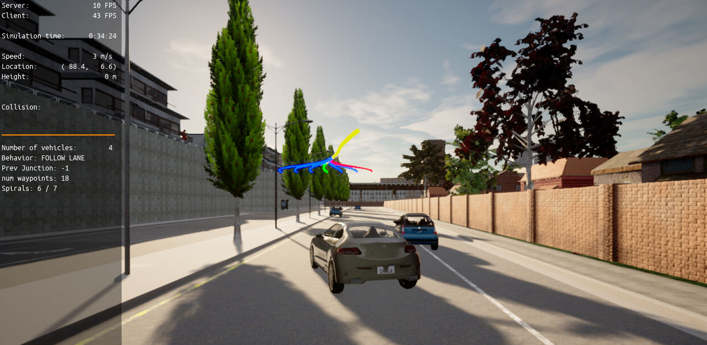
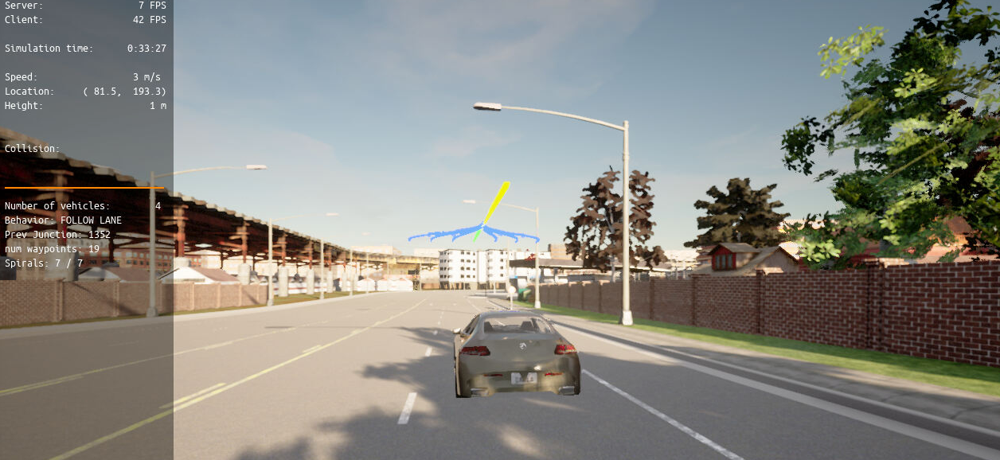

# Motion-Planning-and-Decision-Making-for-Autonomous-Vehicles
## Project Description
In this project the goal is to implement two of the main components of a traditional hierarchical planner: 
 * the Behavior Planner
 * the Motion Planner. 
 
 Both will work in unison to be able to:

 * Avoid static objects (cars, bicycles and trucks) parked on the side of the road (but still invading the lane). The vehicle must avoid crashing with these vehicles by executing either a “nudge” or a “lane change” maneuver.
 * Handle any type of intersection (3-way, 4-way intersections and roundabouts) by STOPPING in all of them (by default)
 * Track the centerline on the traveling lane.

To accomplish this, I've implemented:

 * Behavioral planning logic using Finite State Machines - FSM
 * Static objects collision checking.
 * Path and trajectory generation using cubic spirals
 * Best trajectory selection though a cost function evaluation. This cost function will mainly perform a collision check and a proximity check to bring cost higher as we get closer or collide with objects but maintaining a bias to stay closer to the lane center line.

## Project Results

## Reference code
[behavior_planner_FSM.cpp](project/starter_files/behavior_planner_FSM.cpp)
 
[cost_functions.cpp](project/starter_files/cost_functions.cpp)
 
[motion_planner.cpp](project/starter_files/motion_planner.cpp)
 
[velocity_profile_generator.cpp](project/starter_files/velocity_profile_generator.cpp)
 
[planning_params.h](project/starter_files/planning_params.h)
